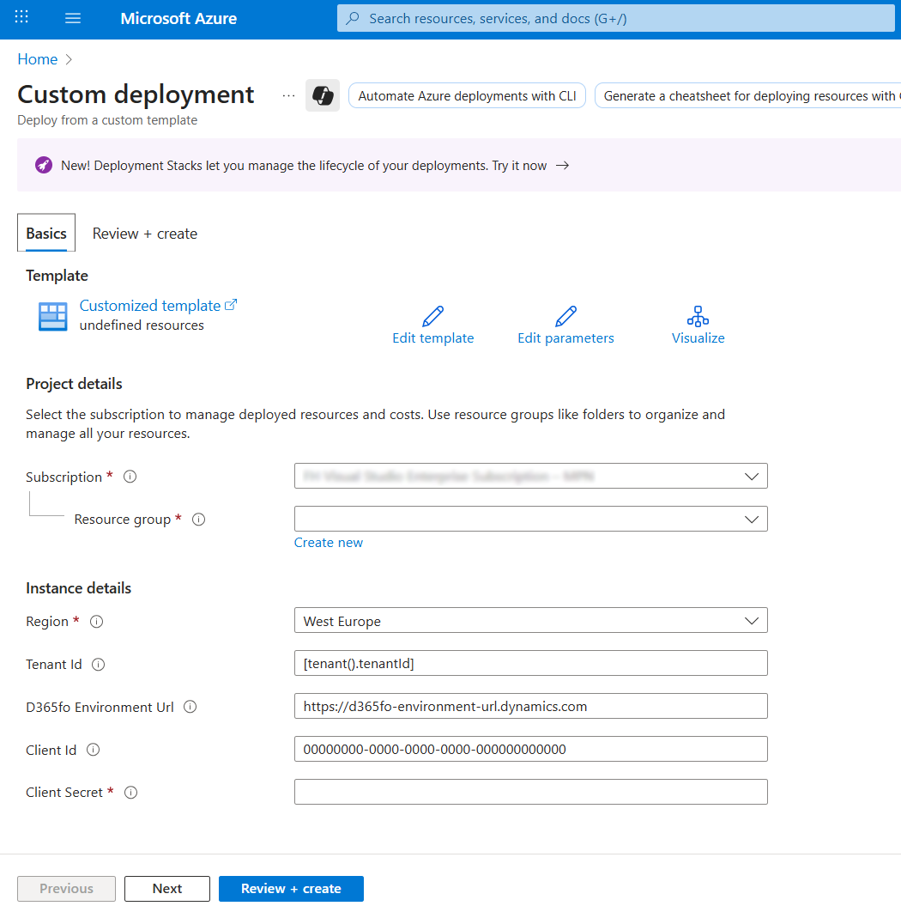
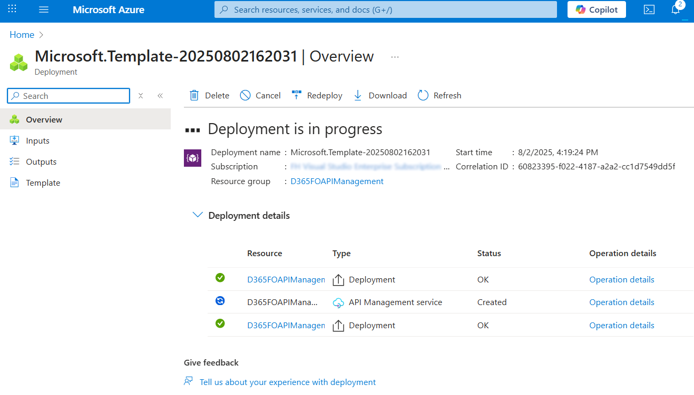
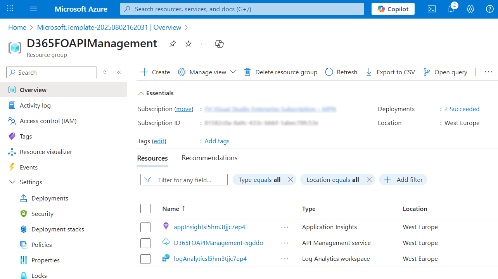
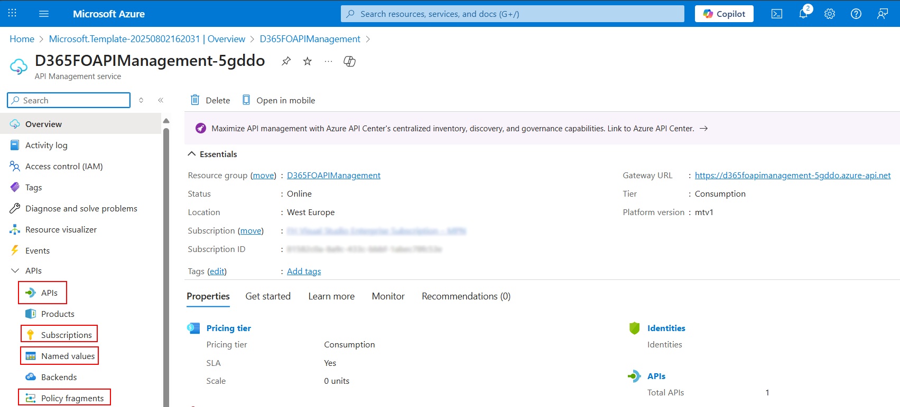
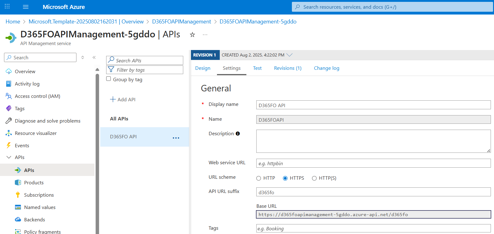
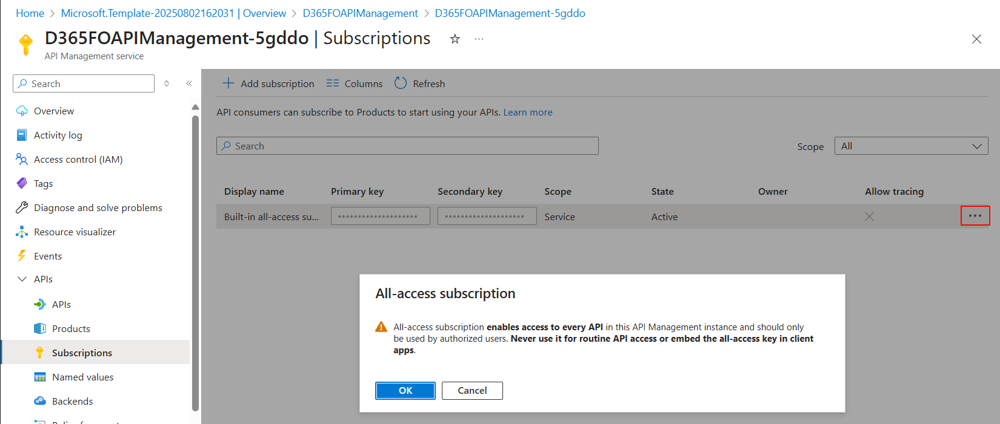

# D365FOAPIM
Azure API Management for Microsoft Dynamics 365 Finance and Operations

[](https://portal.azure.com/#create/Microsoft.Template/uri/https%3A%2F%2Fraw.githubusercontent.com%2FFH-Inway%2FD365FOAPIM%2Frefs%2Fheads%2Fmain%2Fazuredeploy.json)

🚀 This deploys a ready to use Azure API Management instance with an API for Microsoft Dynamics 365 Finance and Operations web services.

🧪 It is intended as a playground to explore and test the capabilities of Azure API Management with Dynamics 365 Finance and Operations. It should not be used for production workloads.

- [D365FOAPIM](#d365foapim)
  - [Deployment](#deployment)
  - [Using the API](#using-the-api)
    - [API Endpoint URL](#api-endpoint-url)
    - [Subscription Key](#subscription-key)


## Deployment

To deploy the Azure API Management instance, click the "Deploy to Azure" button above. This will take you to the Azure portal where you can configure the deployment parameters.

Hovering over the "?" icon next to each parameter will provide you with additional information. The [authentication](https://learn.microsoft.com/en-us/dynamics365/fin-ops-core/dev-itpro/data-entities/services-home-page#authentication) documentation has further guidance on the client id and secret parameters. Those along with the D365FO Environment Url parameter need to be changed to match your environment. The Tenant Id parameter only needs to be changed if the deployment is not done in the same tenant as the D365FO environment. The parameters can also be changed later in the Azure portal after the deployment.



Click "Review + create", review the Microsoft terms and conditions for the deployment and then click "Create" to start it. This will take a few minutes to complete.



Once the deployment is complete, go to the resource group where the API Management instance was deployed to. It should contain three new resources:
- An Azure API Management instance named `D365FOAPIManagement-xxxxx` (where `xxxxx` is a random string
- An Application Insights instance that will be used to monitor the API Management instance
- A Log Analytics workspace that will be used to store the logs of the API Management instance



## Using the API

Click on the API Management instance to open it. To start using the API, you need 2 pieces of information:
- The URL of the API endpoint
- The subscription key to authenticate requests

This information along with some other interesting pieces can be found in the following sections (highlighted in red):
- APIs
- Subscriptions
- Named values
- Policy fragments



### API Endpoint URL

The API endpoint URL can be found in the "APIs" section. Click on the "D365FO API" API to open it, then click on the "Settings" tab. The URL is shown in the "Base URL" field. It should look like this (`xxxxx` is a random string):
```
https://d365foapimanagement-xxxxx.azure-api.net/d365fo
```
This will be the base URL for all API requests. It replaces the D365FO environment URL you would normally use. The other parts of the URL will remain the same. E.g. to query the `Customers` entity, you would still add `/data/Customers` to the base URL:
```
https://d365foapimanagement-xxxxx.azure-api.net/d365fo/data/Customers
```



### Subscription Key

The subscription key can be found in the "Subscriptions" section. It will list one entry called "Built-in all-access subscription" with a masked primary and secondary key field. Click on the three dots menu at the very right of the entry and select "Show/hide keys". This will display a dialog with a warning about using this key. Review the warning and click "OK" to reveal the key.

This key is required to authenticate requests to the API. In you requests, instead of the `Authorization` header with the bearer token, you will instead send a header named `Ocp-Apim-Subscription-Key` with the key as its value.



Now you have everything to start using the API. You can use any HTTP client to send requests to the API endpoint. The API Management instance will handle the authentication and routing to the D365FO environment.
